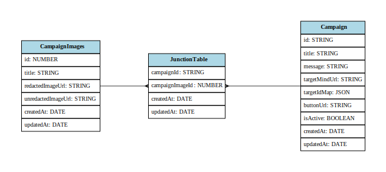

# Server (API)

## Overview
This is the backend API for the AR marketing application. It is an Express + TypeScript server using Sequelize for PostgreSQL database access. The server exposes CRUD endpoints for two main models: `Campaign` and `Target`.

High level responsibilities:
- Store campaign metadata and uploaded images
- Store detection/overlay target records (images + .mind files)
- Provide endpoints for the marketing client to manage campaigns and targets

## Models (quick explanation)

- `Target` — Represents an AR detection target. Fields include:
   - `id` (int): primary key
   - `title` (string | nullable)
   - `description` (string | nullable)
   - `targetImageUrl` (string): URL to the image used by the AR engine to detect
   - `overlayImageUrl` (string | nullable): image shown over the detected target
   - `targetMindUrl` (string | nullable): URL to the generated `.mind` file
   - timestamps: `createdAt`, `updatedAt`

   Purpose: store the image assets and mind file required by the AR runtime to detect and overlay content.

- `Campaign` — Represents a marketing campaign that uses (or previously used) a `Target`.
   - `id` (int): primary key
   - `title` (string)
   - `message` (string)
   - `target_url` (string): URL to the target image (legacy or direct upload)
   - `overlay_url` (string): URL to the overlay image (legacy or direct upload)
   - `targetId` (int): FK (optional depending on API usage) to `Target.id`
   - `button_url` (string)
   - `isActive` (boolean)
   - `comments` (string | nullable)
   - timestamps: `createdAt`, `updatedAt`

   Purpose: store campaign-specific text, image URLs and activation state used by the marketing client.

## Entity Relationship Diagram (ERD)



To regenerate the ERD file on disk run:

```powershell
npm run erd
```

## API Endpoints

All endpoints are mounted on the server root.

Campaign routes:
- GET `/getCampaign/all` — Return all campaigns.
- GET `/getCampaign/active` — Return campaigns where `isActive` is true.
- GET `/getCampaign/:id` — Return a single campaign by id.
- POST `/postCampaign` — Create a new campaign. Accepts multipart form data for optional files:
   - fields: `title`, `message`, `comments`, `button_url`, `isActive` (string/boolean)
   - file fields (optional): `overlay` (image), `target` (image)
   - The server stores uploaded files under `public/uploads` and saves `overlay_url` / `target_url`.
- PUT `/updateCampaign/:id` — Update a campaign. Accepts the same fields as POST; only provided file fields will overwrite URLs.
- DELETE `/deleteCampaign/:id` — Delete a campaign by id.

Target routes:
- POST `/postTarget` — Create a new target. Accepts multipart form data (required):
   - file fields (required): `targetImage`, `overlayImage`, `targetMind`
   - fields: `title` (optional), `description` (optional)
- GET `/getTarget/all` — Return all targets.
- GET `/getTarget/:id` — Return a single target by id.
- PUT `/updateTarget/:id` — Update a target. Accepts the same file and text fields as POST; only provided files/fields are updated.
- DELETE `/deleteTarget/:id` — Delete a target by id. This endpoint currently also deletes related campaigns in a DB transaction.

Notese:
- File uploads use multer and are saved to `public/uploads`.


## TODO / Known Work

- Add authentication middleware (JWT/session) and enable it on write endpoints (currently `allowAll` middleware permits all).
- Update Campaign API to remove direct target-related file/url behavior and instead reference `Target` entities where appropriate (i.e. prefer `targetId` FK and `Target` resources).
- Add validation for incoming payloads (e.g. required fields, max lengths).

## Setup / Run (server)

1. Install dependencies

```powershell
npm install
```

2. Configure environment
- Copy `.env.example` to `.env` and set your PostgreSQL connection values (DB name/user/password/host/port) and `PORT`.

3. Build

```powershell
npm run build
```

4. Start (production)

```powershell
npm run start
```

5. Start (development)

```powershell
npm run dev
```

6. Regenerate ERD

```powershell
npm run erd
```